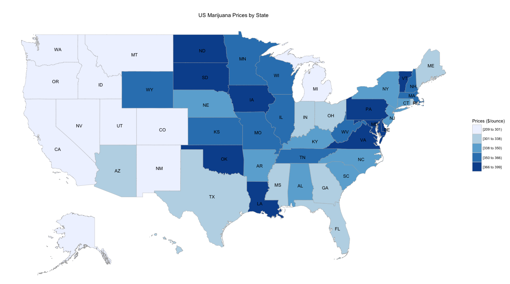
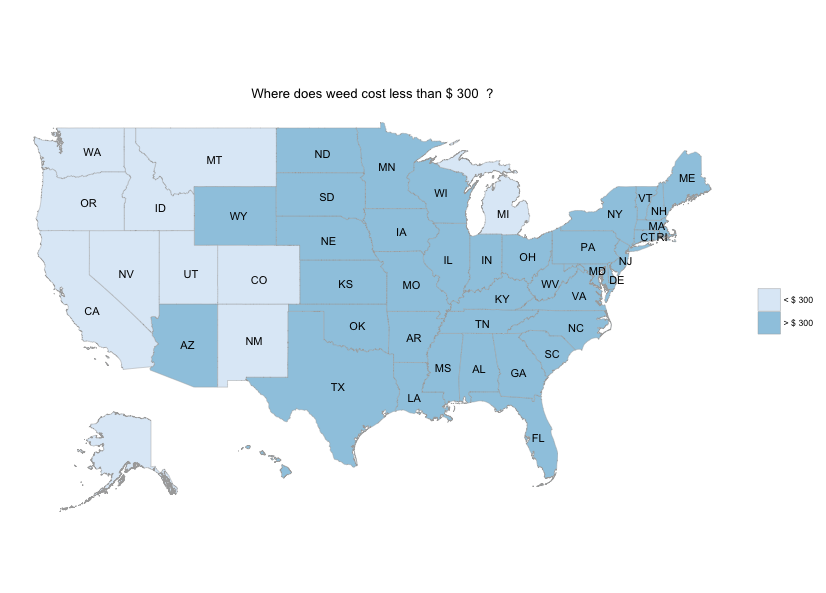

## Slide 1
Introduction:

This is a simple app to visualize marijuana price data scraped from www.priceofweed.com.  

Note that the data is a summary from July 2015 illustrated below.

<!-- Limit image width and height -->

    

---

## Slide 2 
What does the app do?

Simply adjust the maximum price ($/ounce) and the plot will highlight which states offer quality product below that rate like this example:

    

---

## Slide 3

I must credit Matt Hoffman for scraping the data and writing about it here:
http://hiphoff.com/price-of-weed/

The raw data and the scraping code is available here: 
https://github.com/frankbi/price-of-weed

--- 

## Slide 4

Why did the slide show have to be 5 pages when:
* asked to create a simple app
* brief is always > verbose

---

## Slide 5

Enjoy the app!

